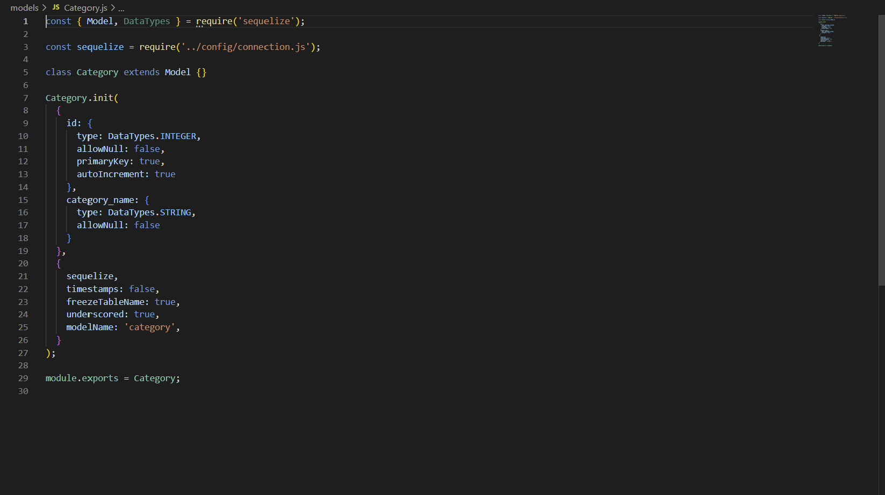

# E-commerce Back End

## Description
This application provides the back end for an e-commerce site. The application uses a MySQL database to store information about the products that an e-commerce site has. There are tables for the different categories of products, the products themselves, and the tags that each product has. An Express.js API is used to connect to the database, and Sequelize is used for interacting with the database. The user can use routes to get all or one category, create, update, and delete categories, and likewise for tags and products.

## Table of Contents

- [Installation](#installation)
- [Usage](#usage)
- [License](#license)
- [Contributing](#contributing)
- [Tests](#tests)
- [Questions](#questions)

## Installation
See the following video for instructions on how to install the project: https://drive.google.com/file/d/1_ohH4oWbUU-Svt96BqwarfgNzgVGQ_mV/view?usp=sharing

## Usage
See the following video for instructions on how to use the project: https://drive.google.com/file/d/1_ohH4oWbUU-Svt96BqwarfgNzgVGQ_mV/view?usp=sharing

## License

    This project is licensed under GNU AGPLv3. You can read more about the license here: 
    

## Contributing
I am not looking for contributers on this project

## Tests
There currently are no tests built in to the project, but you can use Insomnia (for example) to test the API routes. That process is demonstrated in the following video: https://drive.google.com/file/d/1_ohH4oWbUU-Svt96BqwarfgNzgVGQ_mV/view?usp=sharing

## Questions
If you would like to contact me with any questions about the application, my GitHub username is PatrickLQuirk and my email is patrickliamquirk@yahoo.com
